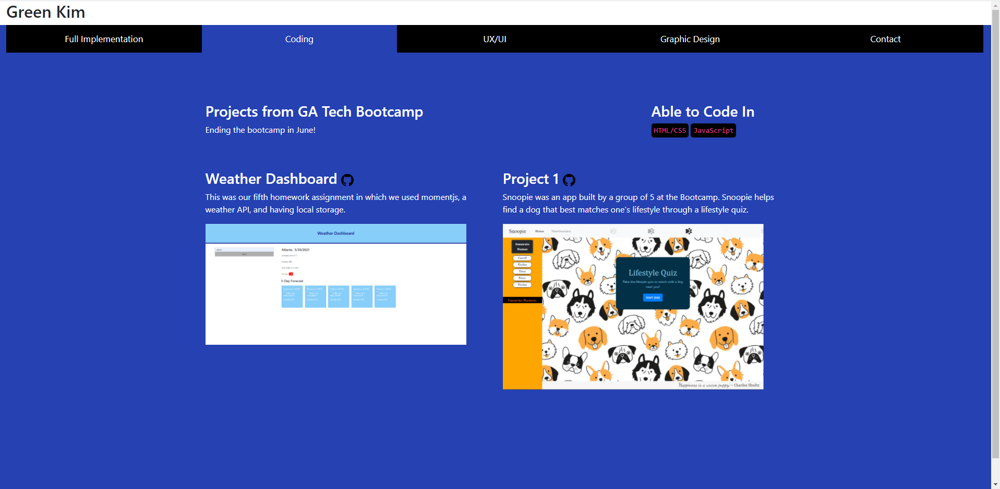

# gt-portfolio

## Description
I first started off with brainstorming how I would be able to section out my portfolio and came to a conclusion of just having a simple UI with tabs. I used a color palette from coolers.co. I tried to utilize what I've learned and not yet have learned by googling. There are still so many things I want to do to my page but I've linked all the things I can so far and will continue to add onto my portfolio page. The challenging part was getting my resume to show in a modal form. Peter helped me with that with both bootstrap and jQuery. 

## Screenshot

[Deployed Site](https://greenkimparsons.github.io/gt-portfolio/)
